<p align="center">
  
</p>

<p align="center">
  <b>一座漂浮在云海上的双层童话塔楼，只用一个 HTML 文件搭成。</b><br>
  <i>A two-storey fairytale tower floating above the clouds, built from a single HTML file.</i>
</p>

<p align="center">
  
  
  
  
  
  <a href="LICENSE"></a>
</p>

<p align="center">
  <a href="https://tower-study.summercommences.com"><b>🌙 在线体验 · Live demo</b></a>
</p>

<p align="center">
  <a href="#简体中文"><b>简体中文</b></a> &nbsp;·&nbsp; <a href="#english"><b>English</b></a>
</p>

<p align="center"></p>

## 简体中文

**塔楼书房**是一个用 three.js 搭成的单文件三维小场景。一座圆塔漂浮在云海之上：楼上是堆满书和魔法小物的书房，楼下是女巫的卧室。
画面是三渲二的卡通风格，可以自由旋转和缩放，也能切换天气、季节和一天中的时间。点一点房间里发光的小东西，看看会发生什么。

### ✨ 你可以……

| | |
|:-:|---|
| 🪜 | 点旋转楼梯**上下楼**：楼上是书房，楼下是女巫的卧室 |
| 🍂 | 切换**春夏秋冬**：藤蔓抽芽、夏夜萤火、红叶纷飞、屋檐积雪 |
| 🌦️ | 切换**五种天气**：晴朗、多云、下雨、雷雨、飘雪（下雪与冬季联动） |
| 🕰️ | 拖动时间滑条，或按 ▶ **让时间流动**；季节会改变日出日落和阳光角度 |
| 🔍 | 找齐藏在两层楼里的 **18 个小发现**，全部找到后整座塔楼会亮起来 |
| 🪄 | 挥魔杖念咒语、看水晶球预言天气、让书本绕着房间飞 |
| 🎶 | 打开留声机，听一支慢华尔兹（声音全部由 WebAudio 实时合成） |
| 🔭 | 坐到桌前，望向窗外的云海 |
| 🌐 | 右上角一键切换 **中文 / English** |

### 🏰 两层楼

<table>
<tr>
<td width="50%" valign="top">

**楼上 · 书房**

- 窗边的书桌、温莎椅、黄铜台灯、摊开的旧书、青花茶具
- 黄铜浑天仪、水晶球、魔杖、会绕着房间飞的书
- 窗边唱歌的蓝色小鸟；打盹的小黑猫（点它叫醒它，点地面它会走过去；它醒着时，指针会变成粉色小猫爪）
- 与楼梯对称的星芒罗盘法阵、窗台花箱和垂吊的花草、挂着窗帘的侧窗

</td>
<td width="50%" valign="top">

**楼下 · 女巫的卧室**

- 胡桃木四柱床配白色床帐和淡紫荷叶边帷幔，床头雕着 🌙 形镂空
- 漂浮的圆月小夜灯、八音盒、会飘出雪花的魔法衣柜、魔镜梳妆台
- 致敬《动物森友会》moon chair 的月亮落地灯，坐在一大片云朵软垫上
- 留声机、会飞的扫帚、衣帽架上的巫师帽和天鹅绒斗篷
- 天花板下漂浮的星星、深蓝底金色星盘地毯、亚麻窗帘

</td>
</tr>
</table>

卧室的设定是一位年轻的成年女巫的房间：浅橡木地板、暖象牙白墙面，家具统一用胡桃木配黄铜，织物是灰紫、鼠尾草绿和亚麻米白。
旋转楼梯穿过地板上的圆形楼梯井，一直通往塔楼下方。

### 🍃 四季与天气

- **春**：藤蔓抽芽、紫藤开花，窗外飘着粉色花瓣
- **夏**：藤叶浓绿、积云更多；白天飘绒絮，夜里有萤火虫
- **秋**：爬山虎转红，落叶随风飘，鸟群排成「人」字南飞
- **冬**：藤蔓落叶，屋顶、墙头和窗沿积雪，挂着冰凌，玻璃结霜

打开页面时默认是当天所在的季节（按北半球月份）。季节也会改变日照：夏天日出早、太阳高；冬天白昼短、太阳低，阳光能斜照进屋子深处。
选「飘雪」会自动入冬，选冬季会开始下雪，离开冬季时雪会自动停。不论什么季节，窗外始终是一片云海。

### 🔍 房间里的小发现

<details>
<summary><b>剧透预警：18 个小发现清单</b>（点击展开）</summary>

<br>

| 书房 · 12 个 | 点一下…… |
|---|---|
| 黄铜台灯 | 台灯亮了，暖光落在书页上 |
| 摊开的旧书 | 书页翻动，扬起一点纸香 |
| 青花茶具 | 倒上一杯热茶 |
| 窗边的蓝色小鸟 | 小鸟跳了两下，唱起歌来 |
| 黄铜浑天仪 | 浑天仪转起来了 |
| 旧木箱 | 木箱里藏着一点金光 |
| 花 | 花开得更盛了 |
| 挂钟 | 挂钟拨快了一小时 |
| 小黑猫 | 小黑猫醒了，正盯着你的指针 |
| 魔杖 | 魔杖挥出了一道咒语 |
| 水晶球 | 水晶球里起了雾 |
| 漂浮的书 | 书本们绕着房间飞了一圈 |

| 卧室 · 6 个 | 点一下…… |
|---|---|
| 月牙雕花床 | 被窝软软的，好想睡一觉 |
| 月亮小夜灯 | 月亮灯亮了，满屋都是星光 |
| 八音盒 | 八音盒叮叮咚咚地奏起一支老圆舞曲 |
| 魔法衣柜 | 衣柜里飘出了雪花……里面好像是另一个世界 |
| 魔镜 | 魔镜说：你今天闪闪发光 |
| 窗边的水晶吊坠 | 水晶转起来，满屋都是小小的彩虹光斑 |

另外还有一些不计入清单、但同样能点的东西：扫帚（绕房间飞一圈）、巫师帽（跳起来转一圈）、斗篷（鼓风飘动）、
漂浮的星星（微光 → 柔光 → 明亮 → 璀璨）、留声机、月亮落地灯、云朵软垫（按扁再弹回来）、温莎椅和各种盆栽。

</details>

### 🎮 操作

| 想做什么 | 桌面 | 触屏 |
|---|---|---|
| 旋转视角 | 拖动 | 单指拖动 |
| 缩放 | 滚轮 / 触控板双指 / 右侧 **+ −**（按住可连续缩放）/ <kbd>+</kbd> <kbd>-</kbd> | 双指捏合 / **+ −** |
| 上下楼 | 点旋转楼梯，或底部的「书房 / 卧室」 | 轻点楼梯 |
| 坐到桌前 | 点温莎椅，或底部的「坐到桌前」（这时 + − 调的是视野） | 同左 |
| 互动 | 点发光的小物件 | 轻点 |
| 天气、季节、时间 | 底部面板 | 同左 |
| 声音、语言 | 右上角的喇叭按钮和 EN / 中 按钮 | 同左 |

### 🚀 本地运行

项目不需要构建：所有代码都在 `tower-study.html` 里；three.js 和字体放在 `static/`，通过 importmap 和 `@font-face` 从本地加载。无需 `npm install`，也不需要联网。

```bash
cd tower-study
python3 -m http.server 8765
```

然后用浏览器打开 <http://localhost:8765/tower-study.html>。也可以用 `npx serve .`。

> [!NOTE]
> 浏览器需支持 WebGL。直接双击用 `file://` 打开时，多数浏览器会拦截 ES module，页面可能加载不出来，请用本地静态服务器。

### ☁️ 部署

网站地址是 <https://tower-study.summercommences.com>，托管在 Cloudflare Pages。

`build.sh` 把网页需要的文件复制到 `dist/`：`tower-study.html` 改名为 `index.html`，再加上 `static/` 和 `_headers`。README、`assets/` 和 `tools/` 都不会发布到网站上。

| Cloudflare Pages 设置 | 值 |
|---|---|
| 框架预设 | None |
| 构建命令 | `sh build.sh` |
| 构建输出目录 | `dist` |
| 自定义域 | `tower-study.summercommences.com` |

`_headers` 给 `static/three-r160/` 设置一年的长缓存，给字体设置 7 天缓存。

字体按页面实际用到的字裁剪过。改了界面文字之后，要重新裁剪一次，否则新字会用系统字体显示：

```bash
pip install fonttools brotli
python3 tools/subset_fonts.py
```

### 🗂️ 目录结构

```text
tower-study/
├── tower-study.html      场景的全部代码（HTML + CSS + three.js 模块脚本）
├── static/               网页用到的静态文件
│   ├── three-r160/       three.js r160 和用到的插件（MIT，附 LICENSE）
│   ├── fonts/            裁剪后的自托管字体和它们的 OFL 许可
│   ├── og-image.png      分享卡片图（1200 × 630）
│   └── favicon.svg …     网站图标（另有 favicon.ico、apple-touch-icon.png）
├── build.sh              生成部署用的 dist/
├── _headers              Cloudflare Pages 的缓存与安全响应头
├── tools/
│   └── subset_fonts.py   按页面文字重新裁剪字体
├── README.md
├── LICENSE               授权说明：代码 MIT，作品 PolyForm Noncommercial
├── LICENSE-MIT
├── LICENSE-POLYFORM-NC
└── assets/
    ├── hero.svg          README 头图（纯 CSS 动画的 SVG）
    ├── make_hero.py      生成头图；加 --og 生成分享图的 SVG 底稿
    └── divider.svg       README 分隔花饰
```

### 🛠️ 二次开发

<details>
<summary><b>代码导览</b>：<code>tower-study.html</code> 自上而下的结构</summary>

<br>

1. 页头：描述、分享卡片（Open Graph）和图标；`<style>` 里是自托管字体的 `@font-face` 和羊皮纸与胡桃木风格的 HUD 样式
2. HUD 的 HTML：天气、季节、视角、时间滑条、小发现列表、语言和声音按钮
3. 第一个普通 `<script>`：中英文案 `window.I18N`、语言切换（记在 localStorage 的 `tower-study-lang`）、加载超时提示
4. `<script type="importmap">`：把 `three` 和 `three/addons/` 映射到 `static/three-r160/`
5. `<script type="module">`：场景本体
   - **两层楼**：`STUDY_L` / `BED_L` 描述每层的墙高、窗户和配色。`makeLevel()` 生成分段墙体，`buildWindow(w, L)` 生成窗户。书房整组是 `room`，卧室是 `lower`，卧室家具放在 `bedFurn` 里（只在楼下时绘制），塔身底座是 `base`
   - **季节与天气**：`outdoor()` 材质补丁负责积雪和四季颜色，`seasonalMesh()` 让每个实例带上四季的颜色与大小，另有四季飘落粒子
   - **缩放**：`zoomBy()` / `stepZoom()` 自己处理滚轮和触控板。three.js r160 的 OrbitControls 按 `|delta| / (100 × 像素比)` 缩放，在 Retina 屏上，小幅触控板手势几乎推不动
   - **交互**：`interactive(root, { key, find, act })` 注册可点击的物件
   - **声音**：`Sound` 类用 WebAudio 实时合成，没有任何音频文件

想改界面文字，只改 `window.I18N` 即可，中英两份放在一起。

头图 `assets/hero.svg` 只用 CSS 动画（没有 SMIL 和脚本），所以在 GitHub 的图片沙盒里也能播放；系统开启「减少动态效果」时会停下来。

</details>

这个项目是在 [Claude Code](https://claude.com/claude-code) 里一步步迭代出来的。想继续改的话，直接让它读写 `tower-study.html` 就行。

### 📜 许可

本项目分两部分授权：

| 内容 | 许可 |
|---|---|
| **程序代码**：渲染设置、相机与缩放、交互框架、四季 / 天气 / 时间系统、WebAudio 合成器、多语言机制等通用逻辑，以及 `build.sh` 和 `tools/` 里的脚本 | [MIT](LICENSE-MIT) |
| **作品本身**：塔楼、房间、家具、小物和角色的设计、建模与布置，配色、程序纹理和画风，界面美术，`window.I18N` 里的文案，旋律，以及 `assets/` 和 `static/` 里的图像（头图、分享图、图标） | [PolyForm Noncommercial 1.0.0](LICENSE-POLYFORM-NC) |

- **技术代码**可以自由复用，包括商业用途。
- **塔楼书房这件作品**可以非商业地使用、修改和分享；商业使用需要先取得作者 [@SummerPapaya](https://github.com/SummerPapaya) 的授权。
- 两部分重叠时（例如复制代码来重现这座塔楼或它的画风），按 PolyForm Noncommercial 处理。完整说明见 [LICENSE](LICENSE)。
- three.js（MIT）随项目放在 `static/three-r160/`，附带它的 LICENSE。
- 字体 Cormorant Garamond、Noto Serif SC、ZCOOL XiaoWei 取自 Google Fonts，裁剪后放在 `static/fonts/`，按 SIL Open Font License 1.1 再发布，许可文本放在同一目录。
- 月亮落地灯的造型是对任天堂《动物森友会》中 moon chair 的同人致敬，本项目与任天堂没有关联。

<p align="right"><a href="#top">↑ 回到顶部</a></p>

<p align="center"></p>

## English

**The Tower Study** is a small 3D scene in a single HTML file, built with three.js. A round tower floats above a sea of clouds: upstairs is a study full of books and magical curiosities, downstairs is a witch's bedroom.
Everything is drawn in a cel-shaded, storybook style. You can orbit and zoom freely, change the weather, the season and the time of day, and click the glowing things in the rooms to see what they do.

### ✨ Things to do

| | |
|:-:|---|
| 🪜 | Click the spiral stairs to **change floors**: the study is upstairs, the witch's bedroom downstairs |
| 🍂 | Switch between the **four seasons**: budding vines, summer fireflies, falling red leaves, snow on the eaves |
| 🌦️ | Pick one of **five kinds of weather**: clear, cloudy, rain, storm or snow (snow and winter go together) |
| 🕰️ | Drag the time slider or press ▶ to **let time flow**; the season changes sunrise, sunset and the angle of the light |
| 🔍 | Find all **18 little discoveries** hidden on the two floors, and the whole tower lights up |
| 🪄 | Flick the wand to cast a spell, ask the crystal orb for a forecast, send the books flying round the room |
| 🎶 | Play a slow waltz on the gramophone (every sound is synthesised live with WebAudio) |
| 🔭 | Sit down at the desk and gaze out over the clouds |
| 🌐 | Switch between **中文 / English** with the button in the top-right corner |

### 🏰 Two floors

<table>
<tr>
<td width="50%" valign="top">

**Upstairs · the study**

- A desk by the window, a Windsor chair, a brass desk lamp, an open old book and a blue-and-white tea set
- A brass armillary sphere, a crystal orb, a magic wand and books that fly round the room
- A blue songbird singing by the window, and a napping black kitten (click it to wake it up, click the floor and it walks over; while it is awake your pointer becomes a little pink paw)
- A compass-star circle mirroring the stairs, a window flower box with trailing flowers, and curtained side windows

</td>
<td width="50%" valign="top">

**Downstairs · the witch's bedroom**

- A walnut four-poster bed with white drapes, pale-lavender valances and a 🌙 cut into the headboard
- A floating full-moon night-light, a music box, an enchanted wardrobe that breathes out snowflakes, and a vanity with a magic mirror
- A moon floor lamp in homage to the Animal Crossing moon chair, resting on a big cloud cushion
- A gramophone, a broom that takes off, and a witch's hat and velvet cloak on the coat stand
- Stars floating under the ceiling, a deep-blue astrolabe rug in gold, and linen curtains

</td>
</tr>
</table>

The bedroom belongs to a young adult witch: pale oak floorboards, warm ivory walls, walnut-and-brass furniture throughout, and fabrics in dusty lavender, sage green and natural linen.
The spiral staircase passes through a round stairwell in the floor and carries on down into the tower below.

### 🍃 Seasons and weather

- **Spring**: the vines bud, the wisteria blooms, and pink petals drift past the windows
- **Summer**: deep green leaves and taller clouds; downy seeds float by day and fireflies glow at night
- **Autumn**: the ivy turns crimson, leaves blow past, and a flock of birds heads south in a V
- **Winter**: the vines go bare, snow settles on the roof, the walls and the sills, icicles hang and the glass frosts over

The page opens in the current season (by northern-hemisphere month). Seasons change the daylight too: summer has early sunrises and a high sun, while winter has short days and a low sun that reaches deep into the room.
Choosing snow turns the season to winter, choosing winter starts the snow, and leaving winter stops it. Whatever the season, the view outside is always a sea of clouds.

### 🔍 Little discoveries

<details>
<summary><b>Spoilers: the list of all 18 discoveries</b> (click to expand)</summary>

<br>

| The study · 12 | Click it and… |
|---|---|
| Brass desk lamp | The lamp glows warm across the pages |
| Open old book | The pages flutter, with a whiff of old paper |
| Blue-and-white tea set | A cup of hot tea, freshly poured |
| Blue songbird by the window | The little bird hops twice and bursts into song |
| Brass armillary sphere | The armillary sphere starts to turn |
| Old wooden chest | Something golden glints inside the chest |
| Flowers | The flowers bloom even brighter |
| Wall clock | The clock jumps forward an hour |
| Black kitten | The kitten wakes up and eyes your cursor |
| Magic wand | The wand flicks out a spell |
| Crystal orb | Mist swirls inside the crystal orb |
| Levitating books | The books take a lap around the room |

| The bedroom · 6 | Click it and… |
|---|---|
| Rosewood bed | The duvet is so soft — time for a nap |
| Moon night-light | The moon lamp glows and starlight fills the room |
| Jewelled music box | The music box plays an old waltz |
| Enchanted wardrobe | Snowflakes drift out of the wardrobe… is there another world inside? |
| Vanity mirror | The mirror whispers: you're sparkling today |
| Hanging crystals | The crystals spin and scatter little rainbows |

There are also things you can click that aren't on the list: the broom (takes a lap of the room), the witch's hat (hops and spins), the cloak (billows),
the floating stars (faint → soft → bright → dazzling), the gramophone, the moon floor lamp, the cloud cushion (squishes and springs back), the Windsor chair and the potted plants.

</details>

### 🎮 Controls

| To… | Desktop | Touch |
|---|---|---|
| Orbit | Drag | Drag with one finger |
| Zoom | Scroll wheel / trackpad pinch / the **+ −** buttons on the right (hold to keep zooming) / <kbd>+</kbd> <kbd>-</kbd> | Pinch / **+ −** |
| Change floors | Click the spiral stairs, or Study / Bedroom in the bottom panel | Tap the stairs |
| Sit at the desk | Click the Windsor chair, or Sit at desk in the bottom panel (+ − then adjusts the field of view) | Same |
| Interact | Click anything that glows | Tap |
| Weather, season, time | The bottom panel | Same |
| Sound, language | The speaker button and the EN / 中 button, top right | Same |

### 🚀 Run it locally

There is no build step: all the code lives in `tower-study.html`, and three.js and the fonts sit in `static/`, loaded locally through an importmap and `@font-face`. There is nothing to `npm install`, and no internet connection is needed.

```bash
cd tower-study
python3 -m http.server 8765
```

Then open <http://localhost:8765/tower-study.html> in your browser. `npx serve .` works too.

> [!NOTE]
> You need a browser with WebGL. Most browsers block ES modules on `file://` pages, so opening the file directly may not work; use a local static server.

### ☁️ Deployment

The site lives at <https://tower-study.summercommences.com> and is hosted on Cloudflare Pages.

`build.sh` copies only what the page needs into `dist/`: `tower-study.html` renamed to `index.html`, plus `static/` and `_headers`. The README, `assets/` and `tools/` are never published to the site.

| Cloudflare Pages setting | Value |
|---|---|
| Framework preset | None |
| Build command | `sh build.sh` |
| Build output directory | `dist` |
| Custom domain | `tower-study.summercommences.com` |

`_headers` caches `static/three-r160/` for a year and the fonts for 7 days.

The fonts are subset to the characters the page actually uses. After changing any on-screen text, subset them again, or the new characters fall back to a system font:

```bash
pip install fonttools brotli
python3 tools/subset_fonts.py
```

### 🗂️ Project layout

```text
tower-study/
├── tower-study.html      the whole scene (HTML + CSS + a three.js module script)
├── static/               static files the page uses
│   ├── three-r160/       three.js r160 and the add-ons it needs (MIT, LICENSE included)
│   ├── fonts/            the subset, self-hosted fonts and their OFL licenses
│   ├── og-image.png      social card image (1200 × 630)
│   └── favicon.svg …     site icons (plus favicon.ico and apple-touch-icon.png)
├── build.sh              builds dist/ for deployment
├── _headers              Cloudflare Pages cache and security headers
├── tools/
│   └── subset_fonts.py   re-subsets the fonts to the page's text
├── README.md
├── LICENSE               how the project is licensed: code MIT, artwork PolyForm Noncommercial
├── LICENSE-MIT
├── LICENSE-POLYFORM-NC
└── assets/
    ├── hero.svg          README banner (an SVG animated with CSS only)
    ├── make_hero.py      regenerates the banner; with --og, the social card's source SVG
    └── divider.svg       README section ornament
```

### 🛠️ Hacking on it

<details>
<summary><b>Code map</b>: <code>tower-study.html</code> from top to bottom</summary>

<br>

1. The page head: description, social card (Open Graph) and icons; the `<style>` block holds the self-hosted fonts' `@font-face` rules and the parchment-and-walnut HUD styles
2. The HUD markup: weather, season, view, the time slider, the discoveries list, and the language and sound buttons
3. The first plain `<script>`: all UI text in both languages (`window.I18N`), the language switch (saved in localStorage as `tower-study-lang`), and the loading timeout
4. `<script type="importmap">`: maps `three` and `three/addons/` to `static/three-r160/`
5. `<script type="module">`: the scene itself
   - **Two floors**: `STUDY_L` / `BED_L` describe each floor's wall height, windows and colours. `makeLevel()` builds the segmented walls and `buildWindow(w, L)` builds the windows. The study group is `room`, the bedroom is `lower`, the bedroom furniture sits in `bedFurn` (drawn only while you are downstairs), and the tower base is `base`
   - **Seasons and weather**: the `outdoor()` material patch handles snow cover and seasonal colours, `seasonalMesh()` gives every instance its own colour and size per season, and there are falling particles for each season
   - **Zoom**: `zoomBy()` / `stepZoom()` handle the wheel and trackpad directly. three.js r160's OrbitControls zooms by `|delta| / (100 × pixel ratio)`, so small trackpad gestures barely move on a Retina screen
   - **Interaction**: `interactive(root, { key, find, act })` registers a clickable object
   - **Sound**: the `Sound` class synthesises everything live with WebAudio; there are no audio files

To change any on-screen text, edit `window.I18N`. Both languages sit side by side there.

The banner `assets/hero.svg` uses CSS animations only (no SMIL, no script), so it plays inside GitHub's image sandbox, and it holds still when the system asks for reduced motion.

</details>

This project was built step by step in [Claude Code](https://claude.com/claude-code). To keep changing it, just ask Claude Code to read and edit `tower-study.html`.

### 📜 License

This project is licensed in two parts:

| What | License |
|---|---|
| **Source code**: the general-purpose logic, such as rendering setup, camera and zoom controls, the interaction framework, the season, weather and time systems, the WebAudio synthesiser and the i18n mechanism, plus `build.sh` and the scripts in `tools/` | [MIT](LICENSE-MIT) |
| **The artwork**: the design, modelling and arrangement of the tower, its rooms, furniture, props and characters; the colours, procedural textures and visual style; the HUD's visual design; the copy in `window.I18N`; the melodies; and the images in `assets/` and `static/` (banner, social card, icons) | [PolyForm Noncommercial 1.0.0](LICENSE-POLYFORM-NC) |

- **The techniques** are free to reuse anywhere, commercial projects included.
- **The Tower Study itself** may be used, changed and shared for any noncommercial purpose; commercial use needs permission from the author, [@SummerPapaya](https://github.com/SummerPapaya), first.
- Where the two overlap (for example, copying code to reproduce the tower or its look), the PolyForm Noncommercial License applies. See [LICENSE](LICENSE) for the details.
- three.js (MIT) ships with the project in `static/three-r160/`, together with its LICENSE.
- The fonts Cormorant Garamond, Noto Serif SC and ZCOOL XiaoWei come from Google Fonts. They are subset, placed in `static/fonts/` and redistributed under the SIL Open Font License 1.1, whose text sits in the same folder.
- The moon floor lamp is a fan homage to the moon chair in Nintendo's Animal Crossing. This project is not affiliated with Nintendo.

<p align="right"><a href="#top">↑ Back to top</a></p>
